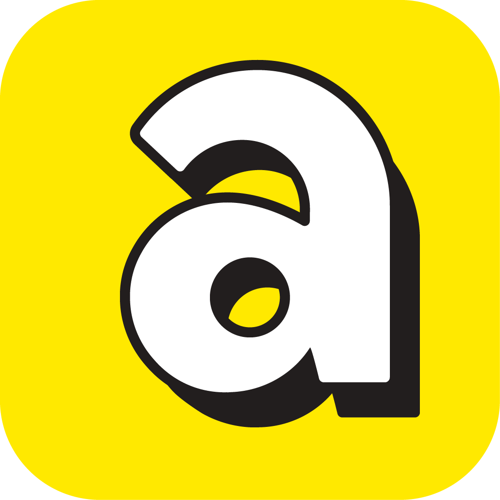

# Avro POS

<div align="center">



**A modern, local-first Point of Sale system for small to medium businesses**

[](https://nextjs.org/)
[](https://www.electronjs.org/)
[](https://www.prisma.io/)
[](https://www.sqlite.org/)
[](https://www.typescriptlang.org/)
[](LICENSE)

[Features](#-features) • [Installation](#-installation) • [Usage](#-usage) • [Documentation](#-documentation) • [Contributing](#-contributing)

</div>

---

## 📖 Overview

**Avro POS** is a secure, privacy-first desktop Point of Sale system built with cutting-edge web technologies. Designed specifically for retail businesses that need reliable, offline-capable operations with optional cloud backup. The system features role-based access control, comprehensive inventory management, and real-time analytics.

### Why Avro POS?

- 🔒 **Privacy First** - All data stored locally on your machine
- ⚡ **Lightning Fast** - Built on SQLite for instant queries
- 🌐 **Offline Ready** - Full functionality without internet
- 🎨 **Modern UI** - Beautiful, responsive interface with dark/light themes
- 🔐 **Secure** - Role-based access control with bcrypt password hashing
- 📊 **Analytics** - Real-time sales insights and reporting
- ☁️ **Optional Cloud Sync** - Google Drive backup when you need it
- 🖨️ **Print Ready** - A4 and thermal receipt printing

---

## Features

### Point of Sale
- Fast product search with SKU scanning
- Real-time cart management with parked carts
- Multiple payment methods (Cash, Card, Mobile Banking)
- Automatic discount and tax calculation
- Customer loyalty points integration
- Receipt generation (A4 & thermal formats)

### Inventory Management
- Complete CRUD operations for products
- Category and subcategory organization
- Low-stock alerts and notifications
- Barcode generation and printing
- Bulk product import via CSV
- Product images and brand tracking
- VAT/Tax configuration (inclusive/exclusive)
- Purchase price and profit margin tracking

### Sales & Analytics
- Real-time dashboard with key metrics
- Daily, weekly, and monthly sales reports
- Revenue and expense tracking
- Top-selling products analysis
- Hourly sales trends
- Customer purchase history
- Profit margin calculations

### Team Management
- Role-based access control (Owner, Manager, Salesman)
- Staff provisioning with unique IDs
- Activity tracking and audit logs
- Granular permission system
- User profile management

### Customer Management
- Customer database with contact info
- Loyalty points system
- Purchase history tracking
- Customer segmentation
- Email and phone validation

### Business Settings
- Customizable business information
- Currency and tax configuration
- Receipt customization
- Backup scheduling
- Google Drive integration

### Backup & Sync
- One-click local backup (JSON + SQLite)
- Scheduled automatic backups
- Google Drive cloud sync
- Data export capabilities

### Audit & Compliance
- Comprehensive audit logging
- Activity tracking for all operations
- User action history
- Compliance-ready reports

---

## Tech Stack

| Layer | Technology |
|-------|-----------|
| **Frontend** | Next.js 15, React 19, Tailwind CSS 3 |
| **State Management** | Zustand with persistence |
| **Desktop Runtime** | Electron 33 |
| **Backend** | Electron IPC (main process) |
| **Database** | SQLite via Prisma 5 ORM |
| **Authentication** | bcryptjs password hashing |
| **Cloud Integration** | Google Drive API (optional) |
| **UI Components** | Recharts, Framer Motion |
| **Language** | TypeScript 5.6 |

---

## Project Structure

```
avro-pos/
├── main/                           # Electron main process
│   ├── main.ts                     # Application entry & IPC handlers
│   ├── preload.ts                  # Context bridge API
│   └── services/                   # Backend services
│       ├── auth.ts                 # Authentication logic
│       ├── bootstrap.ts            # Database initialization
│       ├── capabilities.ts         # Role/permission definitions
│       ├── category.ts             # Category management
│       ├── crm.ts                  # Customer relationship management
│       ├── database.ts             # Prisma client setup
│       ├── gdrive.ts               # Google Drive sync
│       ├── googleDriveAuth.ts      # Google OAuth flow
│       ├── iam.ts                  # Identity & access management
│       ├── inventoryIntelligence.ts # Stock alerts & barcodes
│       ├── localBackup.ts          # Local backup service
│       ├── pos.ts                  # Products & sales engine
│       ├── printer.ts              # Receipt formatting
│       ├── settings.ts             # Business settings
│       ├── status.ts               # Health check & heartbeat
│       ├── supplier.ts             # Supplier management
│       ├── audit.ts                # Audit logging
│       └── updater.ts              # Auto-update checker
│
├── renderer/                       # Next.js frontend
│   ├── app/                        # Next.js app router
│   │   ├── layout.tsx              # Root layout with providers
│   │   ├── page.tsx                # Login & Dashboard
│   │   ├── globals.css             # Global styles & themes
│   │   ├── checkout/               # POS checkout page
│   │   ├── inventory/              # Product management
│   │   ├── sales-history/          # Sales records & printing
│   │   ├── customers/              # Customer management
│   │   ├── suppliers/              # Supplier management
│   │   ├── reports/                # Analytics & reports
│   │   ├── settings/               # Business settings
│   │   └── staff/                  # Team management
│   │
│   ├── components/                 # React components
│   │   ├── AppShell.tsx            # Authenticated layout
│   │   ├── CheckoutView.tsx        # POS interface
│   │   ├── CustomersView.tsx       # Customer list & forms
│   │   ├── DashboardView.tsx       # Dashboard with analytics
│   │   ├── InventoryView.tsx       # Product management UI
│   │   ├── MainLayout.tsx          # Main app layout
│   │   ├── POSView.tsx             # Point of sale view
│   │   ├── ProductForm.tsx         # Product create/edit form
│   │   ├── ReportsView.tsx         # Reports & analytics
│   │   ├── TeamManagement.tsx      # Staff management
│   │   ├── UpdateBanner.tsx        # Update notification
│   │   ├── Money.tsx               # Currency formatter
│   │   └── LayoutWrapper.tsx       # Layout utilities
│   │
│   ├── hooks/                      # Custom React hooks
│   │   ├── useAuth.tsx             # Authentication context
│   │   └── useTheme.tsx            # Theme management
│   │
│   ├── lib/                        # Utilities & types
│   │   ├── api.ts                  # Electron IPC API wrapper
│   │   ├── types.ts                # TypeScript type definitions
│   │   ├── bdFormat.ts             # Bangladesh formatting
│   │   └── version.ts              # App version
│   │
│   ├── store/                      # State management
│   │   └── useCart.ts              # Zustand cart store
│   │
│   └── public/                     # Static assets
│       └── avro-logo.png
│
├── prisma/                         # Database
│   ├── schema.prisma               # Database schema
│   └── migrations/                 # Migration history
│
├── build/                          # Build assets
│   ├── icon.icns                   # macOS icon
│   └── icon.ico                    # Windows icon
│
├── package.json                    # Dependencies & scripts
├── tsconfig.json                   # TypeScript config (Next.js)
├── tsconfig.electron.json          # TypeScript config (Electron)
├── tailwind.config.js              # Tailwind CSS config
├── electron-builder.yml            # Distribution config
└── README.md                       # This file
```

---

## Installation

### Prerequisites

- **Node.js** 20+ ([Download](https://nodejs.org/))
- **npm** 10+ (comes with Node.js)
- **Git** ([Download](https://git-scm.com/))

### Setup Steps

1. **Clone the repository**
   ```bash
   git clone https://github.com/mehedi-pathan/avro-pos.git
   cd avro-pos
   ```

2. **Install dependencies**
   ```bash
   npm install
   ```

3. **Generate Prisma client**
   ```bash
   npm run prisma:generate
   ```

4. **Initialize database**
   ```bash
   npm run prisma:push
   ```

5. **Start development server**
   ```bash
   npm run dev
   ```

The application will open automatically with:
- Next.js dev server at `http://localhost:3000`
- Electron window loading the Next.js app
- Hot reload enabled for both frontend and backend

---

## Usage

### First Login

After installation, use these default credentials:

- **Username:** `owner`
- **Password:** `ChangeMe123!`

> ⚠️ **Important:** Change the default password immediately after first login via Settings → Profile.

### Quick Start Guide

1. **Configure Business Settings**
   - Navigate to Settings
   - Update business name, address, and tax information
   - Set your currency symbol (default: ৳)

2. **Add Products**
   - Go to Inventory
   - Click "Add Product"
   - Fill in SKU, name, price, and stock level
   - Optionally add categories, images, and barcodes

3. **Create Staff Accounts** (Owner only)
   - Navigate to Staff Management
   - Add team members with appropriate roles
   - Assign permissions based on responsibilities

4. **Start Selling**
   - Go to Checkout
   - Search products by name or scan SKU
   - Add to cart and process payment
   - Print receipt

---

## Role-Based Access Control

| Capability | Salesman | Manager | Owner |
|-----------|----------|---------|-------|
| **Checkout** | ✅ | ✅ | ✅ |
| **View Inventory** | ❌ | ✅ | ✅ |
| **Manage Inventory** | ❌ | ✅ | ✅ |
| **View Reports** | ❌ | ✅ | ✅ |
| **Manage Team** | ❌ | ❌ | ✅ |
| **Delete Records** | ❌ | ❌ | ✅ |
| **Cloud Sync** | ❌ | ❌ | ✅ |
| **Settings** | ❌ | ❌ | ✅ |

---

## Building for Production

### Build the Application

```bash
npm run build
```

This compiles:
- Next.js frontend to static files
- TypeScript backend to JavaScript

### Create Distribution Package

**For macOS (.dmg):**
```bash
npm run dist
```

**For Windows (.exe) and macOS:**
Use GitHub Actions (see `.github/workflows/build.yml`)

1. Push your code to GitHub
2. Create a version tag:
   ```bash
   git tag v2.0.3
   git push origin v2.0.3
   ```
3. GitHub Actions will build for both platforms
4. Download from Releases page

Distribution files will be in the `release/` directory.

---

## Database Schema

### Core Models

- **User** - Staff accounts with roles and permissions
- **Customer** - Customer database with loyalty points
- **Product** - Inventory items with categories and pricing
- **Category** - Product categorization
- **Subcategory** - Nested categorization
- **Sale** - Transaction records
- **SaleItem** - Line items for each sale
- **Refund** - Return/refund records
- **RefundItem** - Items being refunded
- **Supplier** - Vendor information
- **Expense** - Business expense tracking
- **AuditLog** - Activity and compliance logging
- **Setting** - Application configuration

### Database Location

- **Development:** `~/Library/Application Support/Electron/pos.db` (macOS)
- **Production:** `~/Library/Application Support/Avro POS/pos.db` (macOS)

---

## 🔧 Configuration

### Environment Variables

Create a `.env` file in the root directory:

```env
DATABASE_URL="file:./prisma/pos.db"
```

### Google Drive Sync (Optional)

1. Create a Google Cloud project
2. Enable Google Drive API
3. Download OAuth credentials
4. Place `credentials.json` in project root
5. Configure in Settings → Cloud Sync

---

## Printing

### Receipt Types

1. **A4 Receipt** - Full-page formatted receipt with business logo
2. **Thermal Receipt** - 58mm thermal printer format

### Print Configuration

Configure printer settings in Settings → Business Settings.

---

## Backup & Recovery

### Local Backup

1. Navigate to Dashboard
2. Click "Backup to Disk"
3. Choose destination folder
4. Backup includes:
   - `backup.json` - All data in JSON format
   - `pos.db` - SQLite database file

### Scheduled Backups

Configure automatic backups in Settings:
- Set backup interval (hourly, daily, weekly)
- Choose backup location
- Enable/disable as needed

### Google Drive Sync

1. Authenticate with Google account
2. Sync uploads database to Drive
3. Automatic conflict resolution
4. Manual sync available anytime

---

## 🛠️ Development

### Available Scripts

```bash
# Development
npm run dev              # Start dev server (Next.js + Electron)
npm run dev:renderer     # Start Next.js only
npm run dev:electron     # Start Electron only

# Building
npm run build            # Build for production
npm run dist             # Create distribution package

# Database
npm run prisma:generate  # Generate Prisma client
npm run prisma:migrate   # Run migrations
npm run prisma:push      # Push schema to database

# Code Quality
npm run lint             # Run ESLint
```

### Tech Stack Details

**Frontend:**
- Next.js 15 with App Router
- React 19 with Server Components
- Tailwind CSS for styling
- Zustand for state management
- Recharts for data visualization
- Framer Motion for animations

**Backend:**
- Electron 33 for desktop runtime
- Prisma 5 as ORM
- SQLite for database
- bcryptjs for password hashing
- Google APIs for Drive integration

---

## 📊 Features Roadmap

### Version 2.1 (Planned)
- [ ] Enhanced dashboard analytics with more charts
- [ ] Multi-currency support
- [ ] Email receipt sending
- [ ] Barcode scanner hardware integration
- [ ] Advanced reporting with PDF export

### Version 2.2 (Planned)
- [ ] Multi-store/branch support
- [ ] Purchase order management
- [ ] Supplier integration
- [ ] Inventory forecasting
- [ ] Mobile app companion

### Version 3.0 (Future)
- [ ] Cloud-hosted option
- [ ] API for third-party integrations
- [ ] Advanced CRM features
- [ ] E-commerce integration
- [ ] Multi-language support

---

## 🤝 Contributing

Contributions are welcome! Please follow these steps:

1. Fork the repository
2. Create a feature branch (`git checkout -b feature/AmazingFeature`)
3. Commit your changes (`git commit -m 'Add some AmazingFeature'`)
4. Push to the branch (`git push origin feature/AmazingFeature`)
5. Open a Pull Request

### Development Guidelines

- Follow TypeScript best practices
- Write meaningful commit messages
- Add tests for new features
- Update documentation as needed
- Ensure code passes linting

---

## Bug Reports

Found a bug? Please open an issue with:
- Clear description of the problem
- Steps to reproduce
- Expected vs actual behavior
- Screenshots if applicable
- System information (OS, Node version, etc.)

---

## License

This project is licensed under the MIT License - see the [LICENSE](LICENSE) file for details.

---

## Author

**Mehedi Pathan**

- Website: [mehedipathan.online](https://mehedipathan.online)
- GitHub: [@mehedi-pathan](https://github.com/mehedi-pathan)

---

## Acknowledgments

- Built with [Next.js](https://nextjs.org/)
- Powered by [Electron](https://www.electronjs.org/)
- Database by [Prisma](https://www.prisma.io/) & [SQLite](https://www.sqlite.org/)
- Styled with [Tailwind CSS](https://tailwindcss.com/)
- State management by [Zustand](https://github.com/pmndrs/zustand)

---

## 📞 Support

For support, email support@avropos.com or open an issue on GitHub.

---

<div align="center">

**Ddeveloped by Mehedi Pathan for businesses**

⭐ Star this repo if you find it helpful!

</div>
